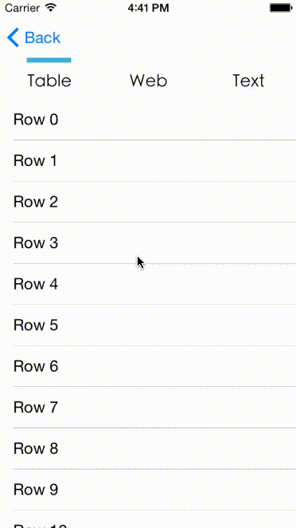
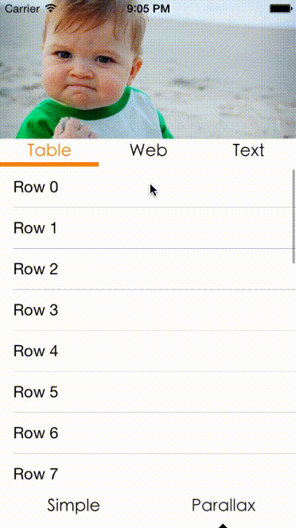

# MXSegmentedPager

[](https://travis-ci.org/maxep/MXSegmentedPager)
[](http://cocoadocs.org/docsets/MXSegmentedPager)
[](http://cocoadocs.org/docsets/MXSegmentedPager)
[](http://cocoadocs.org/docsets/MXSegmentedPager)
[](https://www.versioneye.com/objective-c/mxsegmentedpager)

MXSegmentedPager combines [MXPagerView](https://github.com/maxep/MXPagerView) with [HMSegmentedControl](https://github.com/HeshamMegid/HMSegmentedControl) to control the page selection. The integration of [MXParallaxHeader](https://github.com/maxep/MXParallaxHeader) allows you to add an parallax header on top while keeping a reliable scrolling effect.


|           Simple view         |           Parallax view         |
|-------------------------------|---------------------------------|
|||

## Highlight
+ [HMSegmentedControl](https://github.com/HeshamMegid/HMSegmentedControl) is a very customizable control.
+ [MXParallaxHeader](https://github.com/maxep/MXParallaxHeader) supports any kind of view with different modes.
+ [MXPagerView](https://github.com/maxep/MXPagerView) lazily loads pages and supports reusable page registration.
+ Reliable vertical scroll with any view hierarchy.
+ Can load view-controller from storyboard using a custom segue.
+ Fully documented.

## Usage

+ MXSegmentedPager calls data source methods to load pages. 

```objective-c
#pragma mark <MXSegmentedPagerDataSource>

// Asks the data source to return the number of pages in the segmented pager.
- (NSInteger)numberOfPagesInSegmentedPager:(MXSegmentedPager *)segmentedPager {
    return 10;
}

// Asks the data source for a title realted to a particular page of the segmented pager.
- (NSString *)segmentedPager:(MXSegmentedPager *)segmentedPager titleForSectionAtIndex:(NSInteger)index {
    return [NSString stringWithFormat:@"Page %li", (long) index];
}

// Asks the data source for a view to insert in a particular page of the pager.
- (UIView *)segmentedPager:(MXSegmentedPager *)segmentedPager viewForPageAtIndex:(NSInteger)index {
    
    UILabel *label = [UILabel new];
    label.text = [NSString stringWithFormat:@"Page #%i", index];
    label.textAlignment = NSTextAlignmentCenter;;

    return label;
}
```

+ Adding a parallax header to a MXSegmentedPager is straightforward, e.g:

```objective-c
UIImageView *headerView = [UIImageView new];
headerView.image = [UIImage imageNamed:@"success-baby"];
headerView.contentMode = UIViewContentModeScaleAspectFill;
   
MXSegmentedPager *segmentedPager = [MXSegmentedPager new]; 
segmentedPager.parallaxHeader.view = headerView;
segmentedPager.parallaxHeader.height = 150;
segmentedPager.parallaxHeader.mode = MXParallaxHeaderModeFill;
segmentedPager.parallaxHeader.minimumHeight = 20;
```

## Examples

If you want to try it, simply run:
```
pod try MXSegmentedPager
```
Or clone the repo and run `pod install` from the Example directory first. 

+ See MXSimpleViewController for a standard implementation.
+ See MXParallaxViewController to implement a pager with a parallax header.
+ See MXExampleViewController for a MXSegmentedPagerController subclass example.

This repo also provides a **Swift** example project, see [Example-Swift](Example-Swift).

## Installation

MXSegmentedPager is available through [CocoaPods](https://cocoapods.org/pods/MXSegmentedPager). To install
it, simply add the following line to your Podfile:

```
pod 'MXSegmentedPager'
```

## Documentation

Documentation is available through [CocoaDocs](http://cocoadocs.org/docsets/MXSegmentedPager/).
                                               
## Author

[Maxime Epain](http://maxep.github.io)

[](https://twitter.com/MaximeEpain)
                                               
## License
                                               
MXSegmentedPager is available under the MIT license. See the [LICENSE](LICENSE) file for more info.
